# Obsidian

> Obsidian + OneDrive + Git
>
> 1. 使用Obsidian对md文档进行统一管理
> 2. 使用OneDrive 对文档进行同步(PC、IOS、Android多端同步的最佳方案)， 只有免费的5G额度
> 3. 使用Git进行统一管理(进行备份管理)

## 1 准备工作

1. 注册并登录Microsoft 365的账号(自动拥有永久免费5G的OneDrive盘的空间)

2. 在PC端下载OneDrive并安装

3. 新建仓库 - 创建
   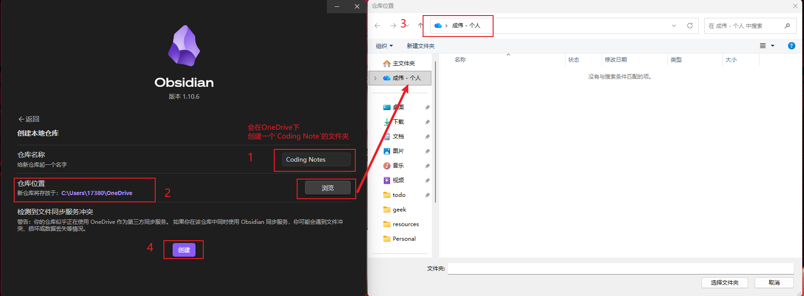

4. 安装插件

   - 设置 -->第三方插件 --> 关闭安全模式(才可以安装插件)

     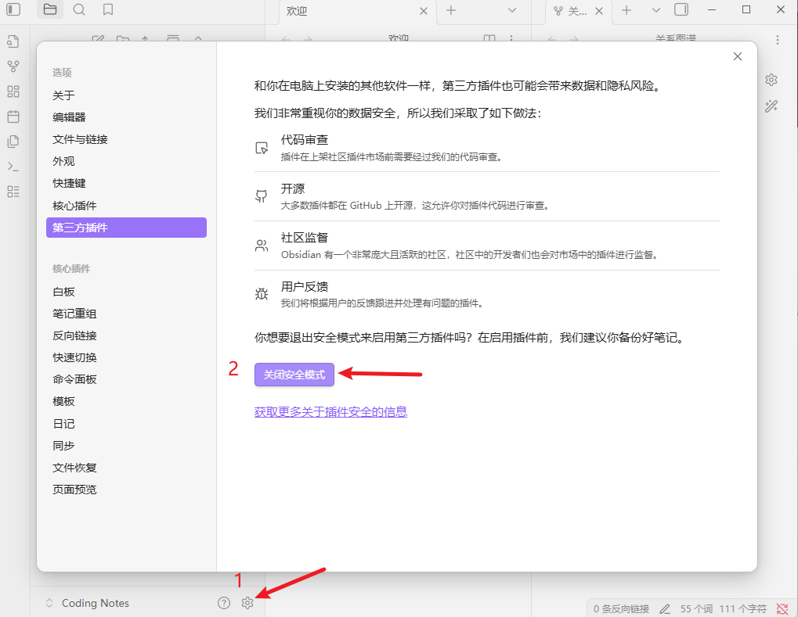

   - 设置 --> 第三方插件 --> 社区插件市场 --> 浏览

     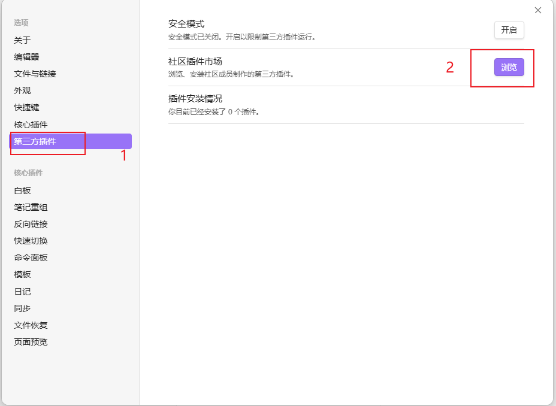

   - 搜索 Remotely Save --> 安装 --> 启用

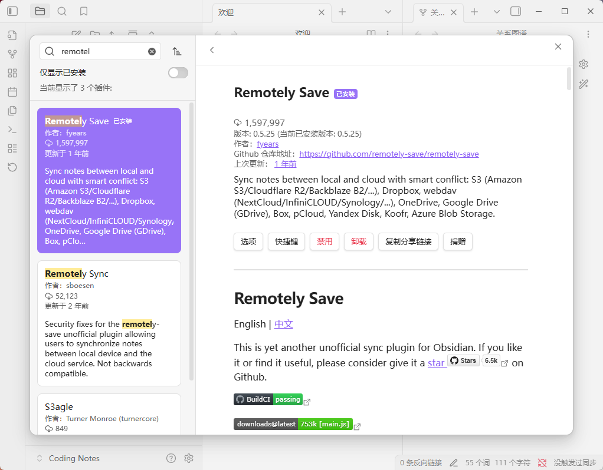

## 2 电脑设置

     1. 设置 --> 第三方插件 --> Remotely Save 

     - 选择远程服务 --> OneDrive(个人版)
     - 鉴权 --> 点击鉴权(点击连接，完成登录，跳回Obsidian应用)
     - 鉴权成功后， --> 检查可否连接 --> 点击--检查
  - 所有配置都成功后，就可以在左侧的刷新按钮进行同步了
   
  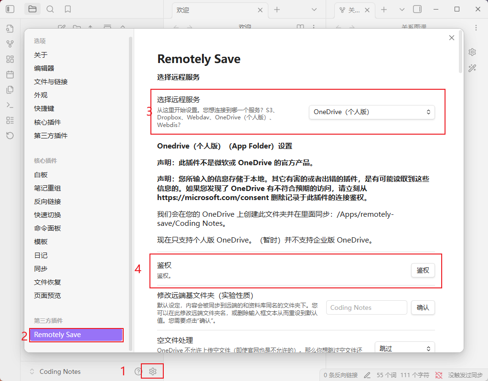
   
  2. 其他配置
   
     - 在 **基本设置 --> 自动运行 --> 每1分钟**
  - 在 **基本设置 --> 启动后自动运行一次 -> 启动后第1秒运行一次 **
     - 在 <font color=red>**进阶设置 --> 如果修改超过百分比则中止同步 --> 100(去除此保护) !!!!**</font>  不设置会导致同步报错

     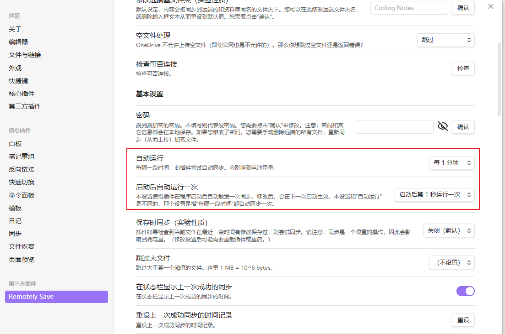
   
     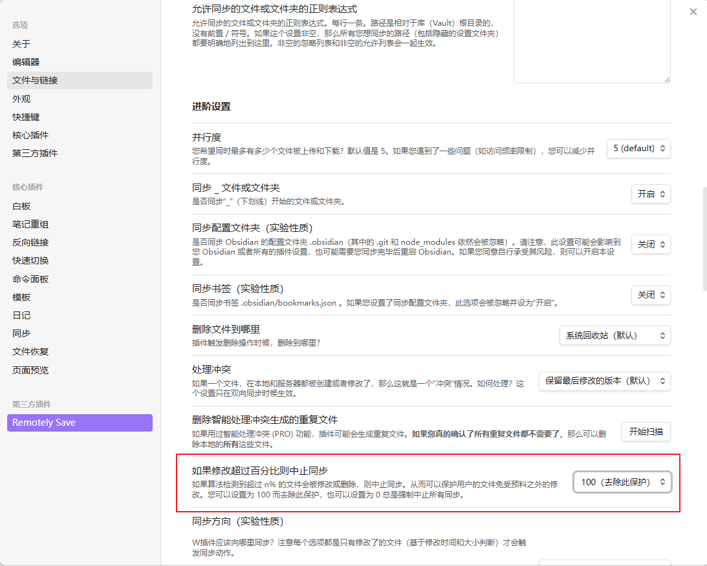

## 3 移动端设置
1. IOS --> App Store --> Obsidian - Connected Notes --> 获取

   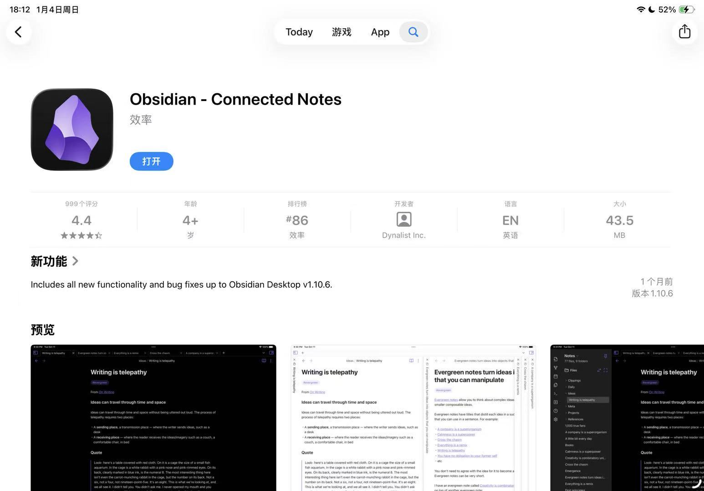

2.  Iphone/Ipad 打开 Obsidian软件 --> Create a value --> Value name(Coding Notes <font color=red>保证跟PC创建的仓库一样</font>)
   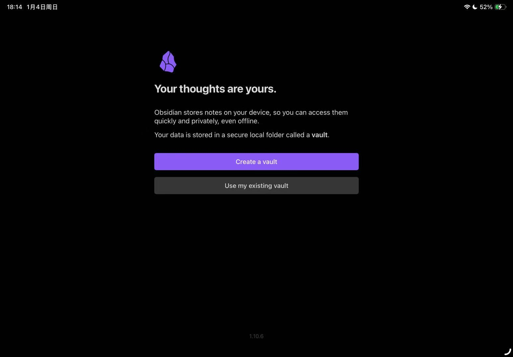

3. 跟PC端一样

   4. 设置 --> Community Plugins --> Turn on Community plugins --> Browse  --> 搜索(Remotely Save)
   5. 在Remotely Save中选择 One Drive for personal & 鉴权
   6. 其他配置和进阶配置(<font color=red>如果修改超过百分比则中止同步 --> 100(去除此保护)</font>)跟PC端一样

## 4 Git 同步
### 4.1 Git 仓库配置
1. Gitee --> 创建仓库 --> Coding Notes
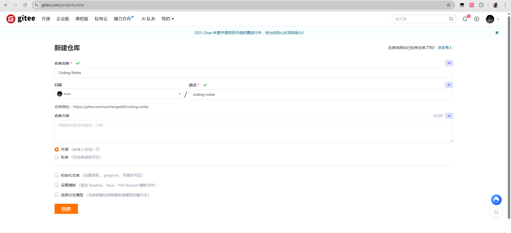
2. 来到Obsidian库所在的文件夹，打开cmd，运行三行git命令
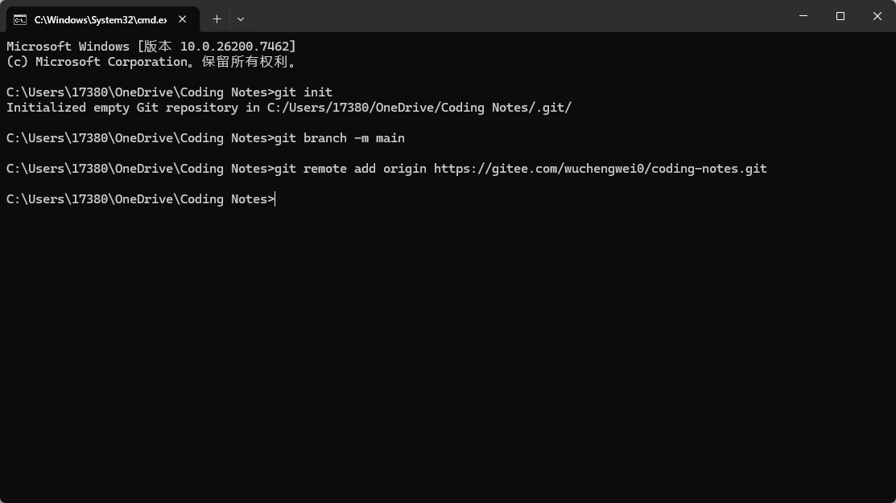
```bat
git init
git branch -m main
git remote add origin https://gitee.com/wuchengwei0/coding-notes.git
```

### 4.2 .gitignore文件
1. 在PC端口OneDrive的Coding Notes目录下，创建 `.gitignore`文件 (要在文件夹下创建)
2. `.gitignore`文件内容
```shell
# 忽略操作系统自动生成的文件
.DS_Store
.Thumbs.db

# 特定设备的工作区状态，避免冲突的关键
.obsidian/workspace.json  # 记录当前Obsidian打开了那些文件和面板等信息
.obsidian/facets.json
.obsidian/starred.json

# 忽略垃圾箱文件夹
.trash/
```
### 4.3 首次提交&推送
1. 回到终端,执行git命令
```shell
git add . 
git commit -m "Init commit: Add all valut"
git push -u origin main
```
4.5 Obsidian中安装Git插件并配置