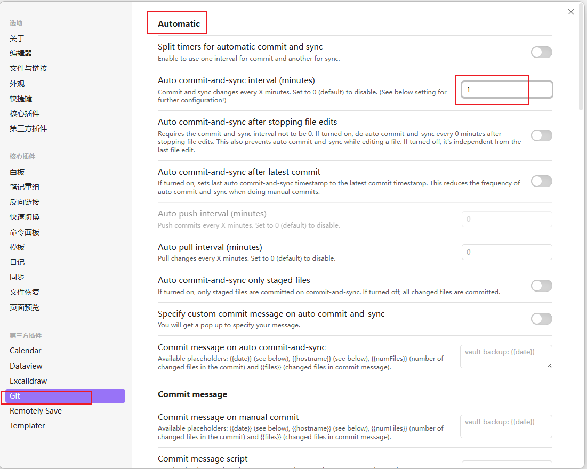
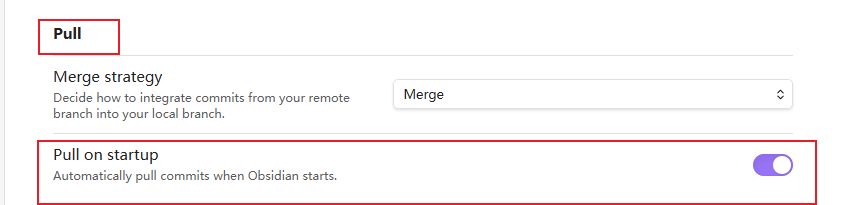

# Obsidian 插件

## 1必装插件
### 1.1. Remotely Save
> [!NOTE] 
> PC、IOS端都需要安装，才可以实现同步
> 同步到OneDrive, 使用这种同步方式，可用实现多端同步(PC、IOS、Android)
### 1.2. Git 

> [!NOTE] 
> 插件作者: Vinzent,(Denis Olehov)
> 同步到Git上，实现文件管理
#### 插件设置
1.  Git --> Pull --> Automatic --> Auto commit-and-sync interval(minutes)  *自动提交的间隔*
2. Git --> Pull --> Pull on startup   *启动时自动拉取更新*
3. Git --> Pull --> Push on commit-and-sync   *在提交同步的同时自动推送(默认开启的)*

### 1.3 ??
??

## 2 其他插件
其他

## 3 美化插件
### 3.1 Hider

> [!NOTE] 
> 作者: @kepano
> 可以隐藏页面元素
### 3.2 File Explorer Note Count

> [!NOTE] 
> z
