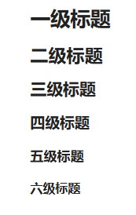

# Obsidian使用语法
## 1 Markdown语法


> [!NOTE] Title
> markdown专注于内容本身，而不是纠结于字体大小、颜色等表面格式。更重要的是，[Markdown文件](https://so.csdn.net/so/search?q=Markdown%E6%96%87%E4%BB%B6&spm=1001.2101.3001.7020)本质上是纯文本，这意味着
> - 文件体积极小
> - 可以用任何文本编辑器打开
> - 易于版本控制
> - 永不过时

**标题层级**
```markdown
# 一级标题 
## 二级标题 
### 三级标题 
#### 四级标题 
##### 五级标题 
###### 六级标题
```

**文本格式化**
