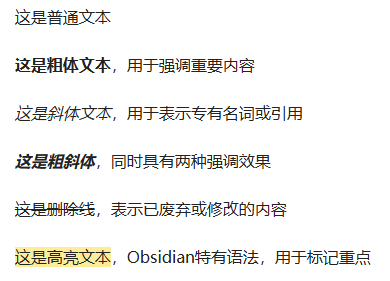
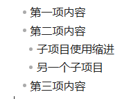
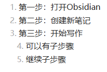
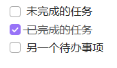
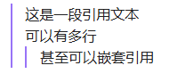

# Obsidian使用语法
## 1 Markdown语法


> [!NOTE] Title
> markdown专注于内容本身，而不是纠结于字体大小、颜色等表面格式。更重要的是，[Markdown文件](https://so.csdn.net/so/search?q=Markdown%E6%96%87%E4%BB%B6&spm=1001.2101.3001.7020)本质上是纯文本，这意味着
> - 文件体积极小
> - 可以用任何文本编辑器打开
> - 易于版本控制
> - 永不过时

### 标题层级
```markdown
# 一级标题 
## 二级标题 
### 三级标题 
#### 四级标题 
##### 五级标题 
###### 六级标题
```

### 文本格式化
```markdown
这是普通文本

**这是粗体文本**，用于强调重要内容

*这是斜体文本*，用于表示专有名词或引用

***这是粗斜体***，同时具有两种强调效果

~~这是删除线~~，表示已废弃或修改的内容

==这是高亮文本==，Obsidian特有语法，用于标记重点

```



### 列表使用
**无序列表**
```markdown
- 第一项内容
- 第二项内容
  - 子项目使用缩进
  - 另一个子项目
- 第三项内容
```


**有序列表**
```markdown
1. 第一步：打开Obsidian
2. 第二步：创建新笔记
3. 第三步：开始写作
   4. 可以有子步骤
   5. 继续子步骤
```

**任务列表**
```markdown
- [ ] 未完成的任务
- [x] 已完成的任务
- [ ] 另一个待办事项
```

### 引用和代码
**引用**
```markdown
> 这是一段引用文本
> 可以有多行
> > 甚至可以嵌套引用
```

**行内代码**

### 链接和图片
**外部链接**
```markdown
[Obsidian官网](https://obsidian.md)
```

**图片插入**


