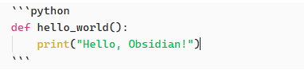

# Obsidian使用语法
## 1 Markdown语法
> [!NOTE]- Markdown优点
> markdown专注于内容本身，而不是纠结于字体大小、颜色等表面格式。更重要的是，[Markdown文件](https://so.csdn.net/so/search?q=Markdown%E6%96%87%E4%BB%B6&spm=1001.2101.3001.7020)本质上是纯文本，这意味着
> - 文件体积极小
> - 可以用任何文本编辑器打开
> - 易于版本控制
> - 永不过时

### 1.1 段落
在 Markdown 中创建段落时，使用空行分隔文本块。每个用空行分隔的文本块都被视为一个独立的段落。
```markdown
This is a paragraph.

This is another paragraph.
```
This is a paragraph.

This is another paragraph.

在文本行之间添加空行会创建不同的段落。这是 Markdown 的默认行为。


### 标题层级
```markdown
# 一级标题 
## 二级标题 
### 三级标题 
#### 四级标题 
##### 五级标题 
###### 六级标题
```

### 文本格式化
```markdown
这是普通文本

**这是粗体文本**，用于强调重要内容

*这是斜体文本*，用于表示专有名词或引用

***这是粗斜体***，同时具有两种强调效果

~~这是删除线~~，表示已废弃或修改的内容

==这是高亮文本==，Obsidian特有语法，用于标记重点

```
这是普通文本

**这是粗体文本**，用于强调重要内容

*这是斜体文本*，用于表示专有名词或引用

***这是粗斜体***，同时具有两种强调效果

~~这是删除线~~，表示已废弃或修改的内容

==这是高亮文本==，Obsidian特有语法，用于标记重点
### 列表使用
**无序列表**
```markdown
- 第一项内容
- 第二项内容
  - 子项目使用缩进
  - 另一个子项目
- 第三项内容
```
- 第一项内容
- 第二项内容
  - 子项目使用缩进
  - 另一个子项目
- 第三项内容

**有序列表**
```markdown
1. 第一步：打开Obsidian
2. 第二步：创建新笔记
3. 第三步：开始写作
   4. 可以有子步骤
   5. 继续子步骤
```
1. 第一步：打开Obsidian
2. 第二步：创建新笔记
3. 第三步：开始写作
   4. 可以有子步骤
   5. 继续子步骤
   6. 
**任务列表**
```markdown
- [ ] 未完成的任务
- [x] 已完成的任务
- [ ] 另一个待办事项
```
- [ ] 未完成的任务
- [x] 已完成的任务
- [ ] 另一个待办事项
- [ ] 
### 引用和代码
**引用**
```markdown
> 这是一段引用文本
> 可以有多行
> > 甚至可以嵌套引用
```

> 这是一段引用文本
> 可以有多行
> > 甚至可以嵌套引用


**行内代码**

```python
def hello_world()
	print("Hello, Obsidian!")
```

### 链接和图片
**外部链接**
```markdown
[Obsidian官网](https://obsidian.md)
```
[Obsidian官网](https://obsidian.md)

**图片插入**
```markdown

```
在Obsidian中，可以直接拖拽图片到编辑器，它会自动生成相应的Markdown语法。

### 表格
```markdown
| 姓名 | 年龄 | 职业 |
|------|------|------|
| 张三 | 25   | 工程师 |
| 李四 | 30   | 设计师 |
| 王五 | 28   | 产品经理 |
```

| 姓名  | 年龄  | 职业   |
| --- | --- | ---- |
| 张三  | 25  | 工程师  |
| 李四  | 30  | 设计师  |
| 王五  | 28  | 产品经理 |
#### Mermaid画图语法
具体使用方法可参考 [Mermaid画图语法](Mermaid画图语法.md)

## Obsidian语法
### 双向链接
**基本使用方法**
```markdown
今天学习了[02 Obsidian 插件](02%20Obsidian%20插件.md)的使用教程。
```
今天学习了[Obsidian_03_插件](Obsidian_03_插件.md)的使用教程。

**高级用法**
```markdown
[[笔记名称#标题名称]]
```

### 标注
```markdown
> [!INFO]
> 这里是callout模块
> 支持**markdown** 和 [[Internal link|wikilinks]].
```
> [!INFO]-
> 这里是callout模块
> 支持**markdown** 和 [[Internal link|wikilinks]].
#### 样式
默认有12种风格。每一种有不同的颜色和图标.
只要把上面例子里的 <font color=red>`INFO`</font> 替换为下面任意一个就行。
- note → 普通提示
- abstract, summary, tldr → 摘要，概要，长话短说
- info, todo → 信息补充，待办
- tip, hint, important → 提示，暗示，重要
- success, check, done → 成功，检查，完成
- question, help, faq → 问题，帮助，常见问题
- warning, caution, attention → 警告、小心、注意
- failure, fail, missing → 失败，未通过，缺失
- danger, error → 危险，错误
- bug → 错误
- example → 例子
- quote, cite → 引用，引用

#### 标题和内容
也可以自定义标题，然后直接不要主体部分，比如
```markdown
> [!TIP] Callouts can have custom titles, which also supports **markdown**!
```
> [!TIP] Callouts can have custom titles, which also supports **markdown**!
#### 折叠
可以使用 `+` 默认展开或者 `-` 默认折叠正文部分
```markdown
> [!FAQ]- Are callouts foldable?
> Yes! In a foldable callout, the contents are hidden until it is expanded.
```
> [!FAQ]- Are callouts foldable?
> Yes! In a foldable callout, the contents are hidden until it is expanded.
