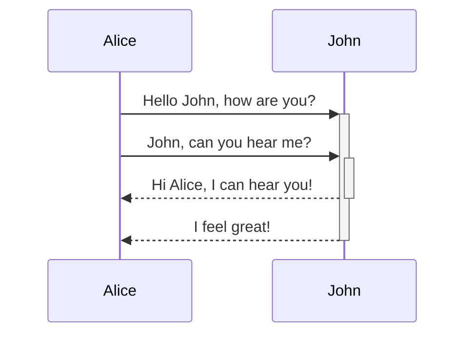
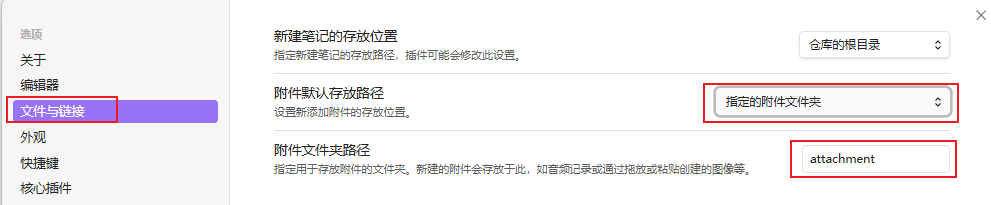

# Obsidian高级语法
[高级格式化语法](https://help.obsidian.md/advanced-syntax)
## 1 表格
可以使用竖线 `|` 分隔列，使用连字符 `-` 定义表头来创建表格。
```markdown
| First name | Last name |
| ---------- | --------- |
| Max        | Planck    |
| Marie      | Curie     |
```

| First name | Last name |
| ---------- | --------- |
| Max        | Planck    |
| Marie      | Curie     |

> [!IMPORTANT] 实时预览中，可以右键单击表格来添加或删除列和行。还可以使用上下文菜单对它们进行排序和移动

可以使用命令面板中的“插入表格”命令插入表格，也可以右键单击并选择“插入”→“表格”。将创建一个基本的、可编辑的表格：
```markdown
|     |     |
| --- | --- |
|     |     |
```
### 格式化表格内的内容
可以使用基本格式语法来设置表格内容的样式(在表格中，设置粗体、斜体、图片、link)


可以通过在标题行中添加冒号 `:` 来对齐列中的文本。也可以通过上下文菜单在实时预览中对齐内容。
```markdown
左对齐 | 中间对齐 | 右对齐
:-- | :--: | --:
Content | Content | Content
```

| 左对齐     |  中间对齐   |     右对齐 |
| :------ | :-----: | ------: |
| Content | Content | Content |
## 2 图表
使用 Mermaid 在笔记中添加图表。Mermaid 支持多种图表类型，例如流程图、顺序图和时间线
还可以尝试使用 `Mermaid` 的实时编辑器来帮助创建图表，然后再将其添加到笔记中。
``````markdown

``````


## 3 数学公式
可以使用 [MathJax](https://docs.mathjax.org/en/latest/basic/mathjax.html) 和 LaTeX 符号在笔记中添加数学表达式
## 4 标签
标签是关键词或主题，可以帮助快速找到所需的笔记。
1. 要创建标签，在编辑器中输入井号`#`，后跟关键词。例如：`#test`。 #test
2. 还可以使用 tags 属性添加标签。YAML 中的标签应始终格式化为列表：
```markdown
---
tags:
  - recipe
  - cooking
---
```
> [!INFO]- 使用搜索插件查找笔记
> 使用标签视图插件查找笔记，例如 tag:#test
### 4.1 嵌套标签
嵌套标签定义了标签层次结构，使查找和筛选相关标签更加便捷。
可以使用正斜杠 `/` 在标签名称中创建嵌套标签，例如 #inbox/to-read 和 #inbox/processing
- 在搜索功能中，tag:inbox,  不仅会匹配 #inbox 还会匹配所有嵌套标签，例如#inbox/to-read。
- 在标签视图中，嵌套标签会显示为属于其父标签。
- 在[Base](Obsidian_04_Base.md)中，嵌套标签可以通过 `hashTag` 函数识别，因此 file.hashTag("a") 将匹配 #a 和 #a/b 
## 5 附件
可以将支持的文件格式或附件导入到的库中，例如图片、音频文件或 PDF 文件。附件是普通文件，可以使用文件系统访问它们。附件可以嵌入到文档中。

> [!TIP]- 更改默认附件位置
> 默认情况下，附件会添加到库的根目录。
> 可以在“**设置**”→“**文件和链接**”→“**新附件默认位置**”下更改默认附件保存位置。
> 

## 6 标注
使用标注功能可以添加额外内容，而不会打断笔记的流畅性。
要创建标注框，请在引用块的第一行添加 `[!info]`，其中 `info` 是类型标识符。类型标识符决定了标注框的外观和样式。要查看所有可用类型，参阅“[支持的类型](Obsidian_02_语法_02高级语法.md#支持的类型)”。
> [!info]- 可折叠标注
> 可以通过在类型标识符后面直接添加加号 `+` 或减号 `-` 来使标注框可折叠  
> 默认情况下，加号会展开标注框，而减号会将其折叠起来。
> ```markdown
> [!info]- 折叠标注
> 内容
> ```
> > [!info]- 折叠标注  
> > 内容

### 6.1 嵌套标注
可以创建多层嵌套的标注
```markdown
> [!question] Can callouts be nested?
> > [!todo] Yes!, they can.
> > > [!example]  You can even use multiple layers of nesting.
```
> [!question] Can callouts be nested?
> > [!todo] Yes!, they can.
> > > [!example]  You can even use multiple layers of nesting.
### 6.2 支持的类型
123


## 99 代码块中粘贴代码块
