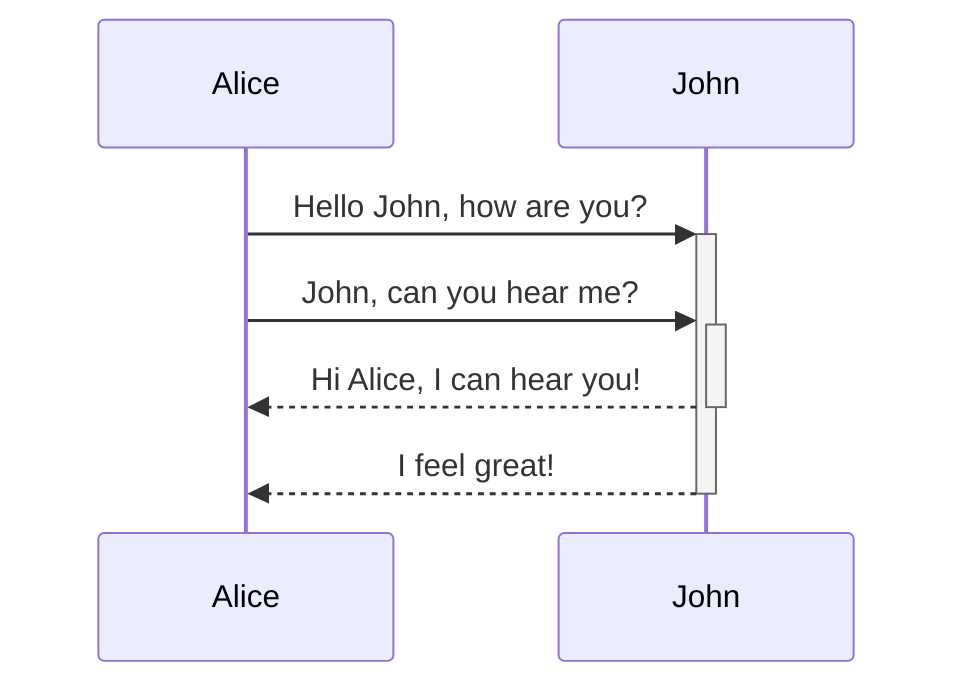
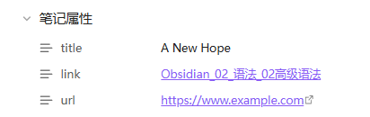
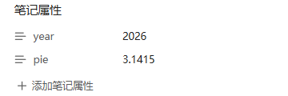
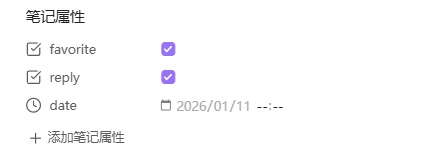
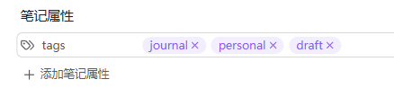

# Obsidian高级语法
[高级格式化语法](https://help.obsidian.md/advanced-syntax)
## 1 表格
可以使用竖线 `|` 分隔列，使用连字符 `-` 定义表头来创建表格。
```markdown
| First name | Last name |
| ---------- | --------- |
| Max        | Planck    |
| Marie      | Curie     |
```

| First name | Last name |
| ---------- | --------- |
| Max        | Planck    |
| Marie      | Curie     |

> [!IMPORTANT] 实时预览中，可以右键单击表格来添加或删除列和行。还可以使用上下文菜单对它们进行排序和移动

可以使用命令面板中的“插入表格”命令插入表格，也可以右键单击并选择“插入”→“表格”。将创建一个基本的、可编辑的表格：
```markdown
|     |     |
| --- | --- |
|     |     |
```
### 格式化表格内的内容
可以使用基本格式语法来设置表格内容的样式(在表格中，设置粗体、斜体、图片、link)


可以通过在标题行中添加冒号 `:` 来对齐列中的文本。也可以通过上下文菜单在实时预览中对齐内容。
```markdown
左对齐 | 中间对齐 | 右对齐
:-- | :--: | --:
Content | Content | Content
```

| 左对齐     |  中间对齐   |     右对齐 |
| :------ | :-----: | ------: |
| Content | Content | Content |
## 2 图表1
使用 Mermaid 在笔记中添加图表。Mermaid 支持多种图表类型，例如流程图、顺序图和时间线
还可以尝试使用 `Mermaid` 的实时编辑器来帮助创建图表，然后再将其添加到笔记中。
``````markdown

``````


## 3 数学公式
可以使用 [MathJax](https://docs.mathjax.org/en/latest/basic/mathjax.html) 和 LaTeX 符号在笔记中添加数学表达式
## 4 标签
标签是关键词或主题，可以帮助快速找到所需的笔记。 ^278cf1
1. 要创建标签，在编辑器中输入井号`#`，后跟关键词。例如：`#test`。 #test
2. 还可以使用 tags 属性添加标签。YAML 中的标签应始终格式化为列表：
```markdown
---
tags:
  - recipe
  - cooking
---
```
> [!INFO]- 使用搜索插件查找笔记
> 使用标签视图插件查找笔记，例如 tag:#test
### 4.1 嵌套标签
嵌套标签定义了标签层次结构，使查找和筛选相关标签更加便捷。
可以使用正斜杠 `/` 在标签名称中创建嵌套标签，例如 #inbox/to-read 和 #inbox/processing
- 在搜索功能中，tag:inbox,  不仅会匹配 #inbox 还会匹配所有嵌套标签，例如#inbox/to-read。
- 在标签视图中，嵌套标签会显示为属于其父标签。
- 在[Base](Obsidian_04_Base.md)中，嵌套标签可以通过 `hashTag` 函数识别，因此 file.hashTag("a") 将匹配 #a 和 #a/b 
## 5 附件
可以将支持的文件格式或附件导入到的库中，例如图片、音频文件或 PDF 文件。附件是普通文件，可以使用文件系统访问它们。附件可以嵌入到文档中。

> [!TIP]- 更改默认附件位置
> 默认情况下，附件会添加到库的根目录。
> 可以在“**设置**”→“**文件和链接**”→“**新附件默认位置**”下更改默认附件保存位置。
> 

## 6 标注
使用标注功能可以添加额外内容，而不会打断笔记的流畅性。
要创建标注框，请在引用块的第一行添加 `[!info]`，其中 `info` 是类型标识符。类型标识符决定了标注框的外观和样式。要查看所有可用类型，参阅“[支持的类型](Obsidian_02_语法_02高级语法.md#支持的类型)”
> [!info]- 可折叠标注
> 可以通过在类型标识符后面直接添加加号 `+` 或减号 `-` 来使标注框可折叠  
> 默认情况下，加号会展开标注框，而减号会将其折叠起来。
> ```markdown
> [!info]- 折叠标注
> 内容
> ```
> > [!info]- 折叠标注  
> > 内容

### 嵌套标注
可以创建多层嵌套的标注
```markdown
> [!question] Can callouts be nested?
> > [!todo] Yes!, they can.
> > > [!example]  You can even use multiple layers of nesting.
```
> [!question] Can callouts be nested?
> > [!todo] Yes!, they can.
> > > [!example]  You can even use multiple layers of nesting.
### 支持的类型
可以使用多种标注类型和别名。每种类型都有不同的背景颜色和图标。  
要使用这些默认样式，请将示例中的“info”替换为以下任何类型，例如 [!tip] 或 [!warning]。也可以在实时预览模式下右键单击标注来更改标注类型。  
除非您自定义标注，否则任何不受支持的类型都将默认为“note”类型。类型标识符不区分大小写。  
类型:
- note → 普通提示
- abstract, summary, tldr → 摘要，概要，长话短说
-  info → 信息补充
- todo → 待办
- tip, hint, important → 提示，暗示，重要
- success, check, done → 成功，检查，完成
- question, help, help → 问题，帮助，常见问题
- warning, caution, attention → 警告、小心、注意
- failure, fail, missing → 失败，未通过，缺失
- danger, error → 危险，错误
- bug → 错误
- example → 例子
- quote, cite → 引用，引用

> [!note] Note

---
> [!abstract] abstract

别名: `summary`，`tldr`

---
> [!INFO] INFO

---

> [!TODO] TODO

---

> [!TIP] Tip

别名: `hint`，`important`

---
> [!success] success

别名: `check`，`done`

---
> [!question] question

别名: `help`，`help`

---
> [!warning] warning

别名: `caution`，`attention`

---
> [!failure] failure

别名: `fail`，`missing`

---
> [!danger] danger

别名: `error`

---
> [!bug] bug

---
> [!example] example

---
> [!quote] quote

别名: `cite`


## 7 笔记属性
属性允许组织笔记中的信息。属性包含结构化数据，例如文本、链接、日期、复选框和数字。  
添加属性后，文件顶部将出现一行，其中包含两个输入框：属性名称和属性值。  
至于名称，可以随意选择。Obsidian 提供了一些默认属性：标签、CSS 类和别名。  
Obsidian 支持以下属性类型：
- [Text](#Text)
- [List](#List)
- [Number](#Number)
- [Checkbox](#Checkbox)
- [Date](#Date)
- [Date & time](#Date & time)
- [Tags](#Tags)

### Text
```markdown
---
title: A New Hope
link: "[[Obsidian_02_语法_02高级语法]]"
url: https://www.example.com
---
```


### List
列表属性包含多个值。列表中的每个值都单独占一行，前面用连字符 (-) 和空格隔开。 
列表值可以包含文本、数字和内部链接。在列表属性中使用内部链接时，用引号将其括起来。
```markdown
---
cast:
  - Mark Hamill
  - Harrison Ford
  - Carrie Fisher
links: 
 - "[[Obsidian_02_语法_01基本语法]]"
 - "[[Obsidian_02_语法_02高级语法]]"
---
```


### Number
数字类型属性必须始终是字面数字，而不是带有运算符的表达式。整数和小数均可接受。
```markdown
---
year: "2026"
pie: "3.1415"
---
```

### Checkbox
复选框属性只有真或假两种值。在实时预览中，会显示为一个复选框。  
```markdown
---
favorite: true
reply: false
last: # Inderminate value; often treated as false
```

### Date
```markdown
---
date: 2026-01-11
---
```


### Date & time
```markdown
---
time: 2026/01/11 10:30
```

### Tags
标签属性是一种特殊的属性类型，仅供标签属性使用。此属性类型不能分配给其他属性。  
标签属性的格式为列表，每个标签单独占一行，标签前以连字符 (-) 和空格隔开。  
```markdown
---
tags: 
  - journal
  - personal
  - draft
---
```


## 8 嵌入网页
要嵌入网页，在笔记中添加以下内容，并将占位符文本替换为要嵌入的网页的 URL：
```markdwon
<iframe src="网页Link"></iframe>
```
> [!ERROR] 提示
> 有些网站不允许用户直接嵌入视频。它们可能会提供用于嵌入视频的网址。如果网站不支持嵌入，请尝试搜索网站名称，并在后面加上“嵌入 iframe”。例如，“youtube 嵌入 iframe”。
### 嵌入视频
要嵌入 YouTube 视频，使用与嵌入[外部图片](https://help.obsidian.md/syntax#External%20images)相同的 Markdown 语法
```markdown

```


### 嵌入推文
要嵌入推文，使用与外部图片相同的 Markdown 语法：
```md

```

## 9 HTML内容
Obsidian支持 部分HTML，但是不建议使用
```markdown
<div>
This **will not** be bold and this `will not` be code.
</div>

```

<div>
This **will not** be bold and this `will not` be code.
</div>


## 10 内部链接
### 文件链接
 - 在编辑器中输入内容`[[`，然后选择要创建链接的文件
#### 链接到笔记中的标题
可以链接到笔记中的特定标题，也称为_锚链接  
#### 链接到同一笔记中的标题
要链接到同一笔记中的某个标题，键入 `[[#` 以获取笔记中要链接的标题列表  
例如， `[[#Preview a linked file]]`

#### 链接到另一篇笔记中的标题
要链接到另一篇笔记中的标题，`#`在链接目标的末尾添加井号 ( )，然后是标题文本。  
例如， `[[Obsidian#Links are first-class citizens]]`

#### 链接到子标题
每个子标题可以添加多个井号 `#`。  
例如， `[[Help and support#Questions and advice#Report bugs and request features]]`

### 链接到笔记中的某个模块
文本块是指笔记中的一个文本单元，例如段落、引用块或列表项。  

`#^`可以通过在链接目标地址末尾添加 `<block_id>` 并后跟唯一的区块标识符来链接到某个区块。例如： `[[2023-01-01#^37066d]]``<block_id>`。当输入插入符号 (` `^`)` 时，将会出现一个建议列表，方便您选择正确的区块。  
对于_简单段落_`^`，在行尾放置一个空格，后跟一个插入符号和块标识符：
```markdwon
The quick purple gem dashes through the paragraph with blazing speed. Pen in hand and a paperclip in the other, Gemmy works toward her goal of making the world of note-taking a happier place. ^37066d
```

### 更改链接显示文本
默认情况下，Obsidian 会按原样显示链接文本。例如：

- `[[Example]]`显示为[示例](https://help.obsidian.md/Example)
- `[[Example#Details]]`显示为[“示例 > 详细信息”](https://help.obsidian.md/Example#Details)
可以通过自定义链接文本来更改链接的显示方式
**Wikilink 格式** ：

## 11 别名
如果想使用不同的名称引用同一个文件，请考虑为笔记添加_别名_。别名是笔记的另一个名称。  
使用别名来指代缩写词、昵称，或者指代其他语言的笔记    

要为笔记添加别名，`aliases`在笔记[属性](https://help.obsidian.md/properties)中添加该属性。别名应始终以 YAML 列表的形式格式化。
```markdown
aliases:
  - Obsidian高级语法
```
此时便可在其他地方引用改文件的别名 [Obsidian高级语法](Obsidian_02_语法_02高级语法.md)

## 12 嵌入文件
将一条笔记嵌入到另一条笔记中
**1. 嵌入笔记：**
```md
![[Internal links]]
```
**2. 嵌入指向标题和模块的链接**
```markdown
[Obsidian标签](Obsidian_02_语法_02高级语法.md#^278cf1)
```
[Obsidian标签](Obsidian_02_语法_02高级语法.md#^278cf1)定义

**3. 在便笺中嵌入列表**
要嵌入来自其他笔记的列表，先向列表添加块标识符：
```markdown

- list item 1
- list item 2

^my-list-id
```
然后使用块标识符链接到列表：
```markdown
![[My note#^my-list-id]]
```

**4.嵌入搜索结果**
``````
```query
embed OR search
```
``````

```query
embed OR search
```


## 99 代码块中粘贴代码块
