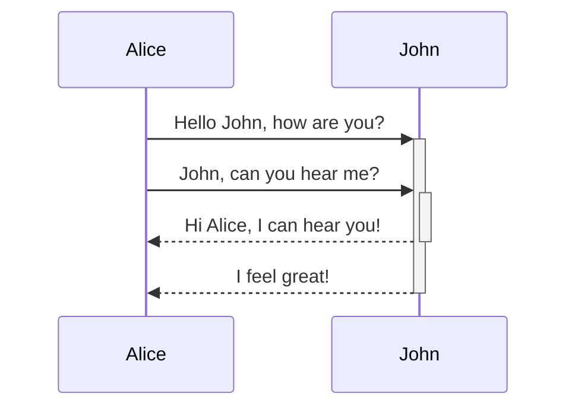

# Obsidian高级语法
[高级格式化语法](https://help.obsidian.md/advanced-syntax)
## 1 表格
可以使用竖线 `|` 分隔列，使用连字符 `-` 定义表头来创建表格。
```markdown
| First name | Last name |
| ---------- | --------- |
| Max        | Planck    |
| Marie      | Curie     |
```

| First name | Last name |
| ---------- | --------- |
| Max        | Planck    |
| Marie      | Curie     |

> [!IMPORTANT] 实时预览中，可以右键单击表格来添加或删除列和行。还可以使用上下文菜单对它们进行排序和移动

可以使用命令面板中的“插入表格”命令插入表格，也可以右键单击并选择“插入”→“表格”。将创建一个基本的、可编辑的表格：
```markdown
|     |     |
| --- | --- |
|     |     |
```
### 格式化表格内的内容
可以使用基本格式语法来设置表格内容的样式(在表格中，设置粗体、斜体、图片、link)


可以通过在标题行中添加冒号 `:` 来对齐列中的文本。也可以通过上下文菜单在实时预览中对齐内容。
```markdown
左对齐 | 中间对齐 | 右对齐
:-- | :--: | --:
Content | Content | Content
```

| 左对齐     |  中间对齐   |     右对齐 |
| :------ | :-----: | ------: |
| Content | Content | Content |
## 2 图表
使用 Mermaid 在笔记中添加图表。Mermaid 支持多种图表类型，例如流程图、顺序图和时间线
还可以尝试使用 `Mermaid` 的实时编辑器来帮助创建图表，然后再将其添加到笔记中。
``````markdown

``````


## 99 代码块中粘贴代码块
