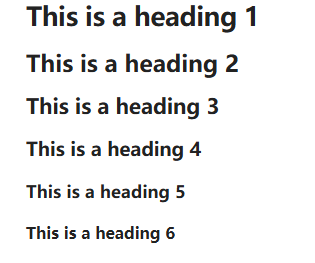

# Markdown语法
## 1 段落
在 Markdown 中创建段落时，使用空行分隔文本块。每个用空行分隔的文本块都被视为一个独立的段落。
```markdown
This is a paragraph.

This is another paragraph.
```
This is a paragraph.

This is another paragraph.

在文本行之间添加空行会创建不同的段落。这是 Markdown 的默认行为。
> [!IMPORTANT]- 多个空白处(空格/回车)
> 段落内和段落之间的多个相邻空白会合并成一个空白
> ```markdown
> Multiple          adjacent          spaces
>
>
>
> and multiple newlines between paragraphs.
>```
>Multiple          adjacent          spaces
>
>
>
> and multiple newlines between paragraphs.
> <font color=red>如果想防止空格重叠或添加多个空格，可以使用 &nbsp;（不间断空格）或 `<br>`（换行符）HTML 标签</font>
## 2 换行
在 Markdown 中，默认情况下，按一次 Enter 键会在笔记中创建新行，但在渲染输出中，这会被视为同一段落的延续。要在段落内插入换行符而不另起一段，可以：
- 在按 Enter 键之前，在行尾添加两个空格
> [!QUESTION]- 为什么在阅读视图中多次按下回车键不会产生更多换行符？
> 在 Markdown 中，单个 Enter 键会被忽略，连续多次按下 Enter 键只会生成一个新的段落。这种行为符合 Markdown 的软换行规则，即多余的空行不会生成额外的换行符或段落，而是会被合并成一个段落分隔符。这是 Markdown 默认的文本处理方式，确保段落自然流畅，避免出现意外的断行。
> > [!QUESTION]- 启用严格换行符(默认开启)
> > 1. 打开 `Setting`
> > 2. `编辑器` -> `严格换行`(开启后，根据Markdown标准，单个换行符在预览模式下不在生效)
> > 3. 打开 `Enable` 开关  
> > 
> > 在 Obsidian 中启用<font color=red>“严格换行”</font>后，换行符会根据换行方式的不同而呈现三种不同的行为：  
> > 1. **单回车符（无空格）**：渲染时，单回车符（无尾随空格）会将两行合并为一行。  
> > ```markdown
> > line one
> > 
> > line two
> > ```
> > 渲染结果如下：  
> > line one
> > line two    
> > 2. **单回车后跟两个或多个空格**：如果在第一行末尾添加两个或多个空格后再按 Enter 键，这两行仍然属于同一个段落，但会被换行符（HTML `<br>` 元素）分隔开。在本例中，我们将使用两个下划线来代替空格。
> > ```markdown
> > line three__  
> > line four
> > ```
> > 渲染结果如下：  
> > line three__  
> > line four  
> > 3. **双回车（带或不带尾随空格）**：按两次（或更多次）回车键会将行分隔成两个不同的段落（HTML `<p>` 元素），无论是否在第一行末尾添加空格。
> > ```markdown
> > line five
> > 
> > line six
> > ```
> > 渲染结果如下：  
> > line five
> > 
> > line six
> 
## 3 标题
要创建标题，在标题文本前添加最多六个 # 符号。# 符号的数量决定了标题的级别。
```markdown
# This is a heading 1
## This is a heading 2
### This is a heading 3
#### This is a heading 4
##### This is a heading 5
###### This is a heading 6
```
  

## 4 粗体、斜体、高亮

| 风格      | 句法                    | 例子                           | 输出                       |
| ------- | --------------------- | ---------------------------- | ------------------------ |
| 粗体      | `** **` 或 `__ __`     | `**粗体文本**` 或 `__粗体文本__`      | **粗体文本** __粗体文本__        |
| 斜体      | `* *` 或 `_ _`         | `*斜体文本*` 或 `_斜体文本_`          | *斜体文本*   _斜体文本_          |
| 删除线     | `~~ ~~`               | `~~删除线~~`                    | ~~删除线~~                  |
| 高亮      | \`== ==`              | \`\=\=高亮\=\=\`               | ==高亮==                   |
| 粗体和嵌套斜体 | `** **` 和 `_ _`       | `**粗体和_斜体_文本**`              | **粗体和_斜体_文本**            |
| 粗体和斜体   | `*** ***` 或 `___ ___` | `***粗体和斜体***`  `___粗体和斜体___` | ***粗体和斜体***  ___粗体和斜体___ |

> [!IMPORT]- 可以通过在格式文本前面添加反斜杠 \ 来强制将其显示为纯文本
> ```markdown
> \*\*此行不会加粗\*\*
> ```
> \*\*此行不会加粗\*\*  
> <br>
> ```markdown
> \**这一行将以斜体显​​示，并显示星号。*\*
> ```
> \**这一行将以斜体显​​示，并显示星号。*\*

## 5 内部链接
Obsidian 支持两种笔记内部链接格式：
- Wikilink: `[[Three laws of motion]]`
- Markdown: `[Three laws of motion](Three%20laws%20of%20motion.md)`
## 6 外部链接
如果要链接到外部 URL，可以通过将链接文本用方括号 `[ ]` 括起来，然后将 URL 用圆括号 `( )` 括起来来创建内联链接。
```markdown
[Obsidian Help](https://help.obsidian.md)
```
[Obsidian Help](https://help.obsidian.md)  


也可以通过链接到 Obsidian URI 来创建指向其他库中文件的外部链接
```markdown
[Note](obsidian://open?vault=MainVault&file=Note.md)
```
## 7 外部图像
通过在图片名称前添加感叹号 (!) 来添加带有外部 URL 的图片
```markdown

```

> [!TIP]- 更改图像尺寸
> 可以通过在链接目标中添加 [100x145] 来更改图像尺寸，其中 640 是宽度，480 是高度
> ```markdown
> 
> ```
> 
> 
> 如果只指定宽度，图像将按其原始宽高比缩放。例如：
> ```markdown
> 
> ```
> 

## 8引用
可以通过在文本前面添加 > 符号来引用文本
```markdown
> Human beings face ever more complex and urgent problems, and their effectiveness in dealing with these problems is a matter that is critical to the stability and continued progress of society.

\- Doug Engelbart, 1961
```
> Human beings face ever more complex and urgent problems, and their effectiveness in dealing with these problems is a matter that is critical to the stability and continued progress of society.

\- Doug Engelbart, 1961

## 9 列表
1. 可以通过在文本前添加 -、* 或 + 来创建无序列表
```markdown
- First list item
- Second list item
- Third list item
```
- First list item
- Second list item
- Third list item

2. 创建有序列表，每行以数字开头，后跟一个 . 或 ) 符号
```markdown
1. First list item
2. Second list item
3. Third list item
```
1. First list item
2. Second list item
3. Third list item
```markdown
1) First list item
2) Second list item
3) Third list item
```
3. 使用 Shift+Enter 在有序列表中插入换行符，而不会改变编号
```markdown
1. First list item
   
2. Second list item
3. Third list item
   
4. Fourth list item
5. Fifth list item
6. Sixth list item
```
1. First list item
   
2. Second list item
3. Third list item
   
4. Fourth list item
5. Fifth list item
6. Sixth list item
## 10 任务清单
创建任务列表，请以连字符`-`和空格开头，后跟`[ ]` 来表示每个列表项
```markdown
- [x] This is a completed task.
- [ ] This is an incomplete task.
```
- [x] This is a completed task.
- [ ] This is an incomplete task.
在阅读视图中，可以通过选中复选框来切换任务

> [!TIP]- Tip
> 可以使用括号内的任何字符来标记它已完成
> ```markdown
> - [x] Milk
> - [?] Eggs
> - [ ] Eggs
> ```
> - [x] Milk
> - [?] Eggs
> - [ ] Eggs

## 11 嵌套列表
可以将任何类型的列表（有序列表、无序列表或任务列表）嵌套在任何其他类型的列表之下。

要创建嵌套列表，缩进一个或多个列表项。可以在嵌套结构中混合使用不同类型的列表：
```markdown
1. First list item
   2. Ordered nested list item
3. Second list item
   - Unordered nested list item
```
1. First list item
   2. Ordered nested list item
3. Second list item
   - Unordered nested list item

同样，也可以通过缩进一个或多个列表项来创建嵌套任务列表：
```markdown
- [ ] Task item 1
	- [ ] Subtask 1
- [ ] Task item 2
	- [ ] Subtask 1
```
- [ ] Task item 1
	- [ ] Subtask 1
- [ ] Task item 2
	- [ ] Subtask 1


## TODO
## TODO
## TODO
## TODO